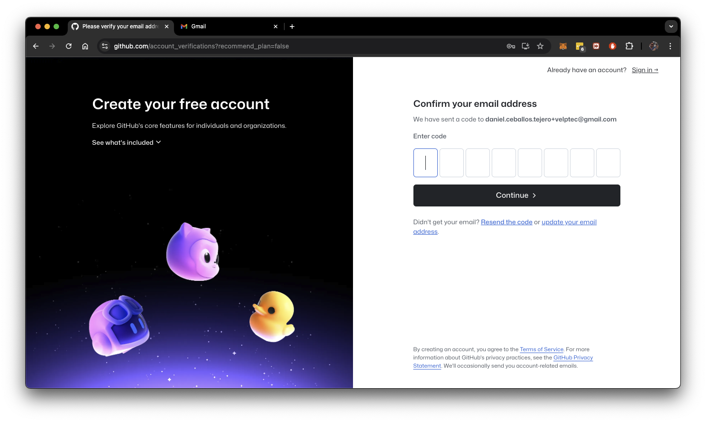
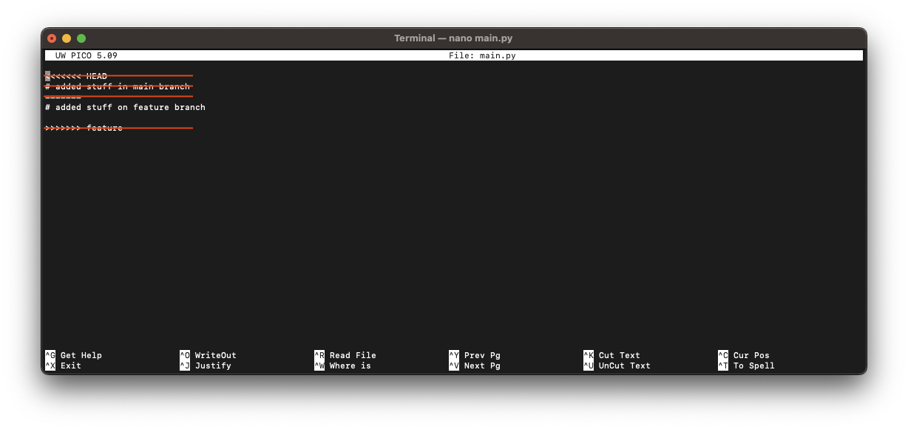

# velpTEC Pruefung - GitHub Repository Setup und Workflow

## Inhalt 
- [Einrichtung GitHub-Repository](#einrichtung-github-repository)
- [Erstellung SSH-Key](#erstellung-ssh-key)
- [Erstellung und Konfiguration lokales Repository](#erstellung-und-konfiguration-lokales-repository)
- [Workflow: Branching](#workflow-branching)
  - [Arbeiten im `main`-Branch](#arbeiten-im-main-branch)
  - [Arbeiten im `feature`-Branch](#arbeiten-im-feature-branch)
  - [Weitere Arbeiten im `main`-Branch](#weitere-arbeiten-im-main-branch)
- [Workflow: Merging (mit Konflikt)](#workflow-merging-mit-konflikt)
- [Repository bei GitHub veroeffentlichen](#repository-bei-github-veroeffentlichen)

## Einrichtung GitHub-Repository

1. [github.com](https://github.com) besucht  

2. Account erstellt  
    

3. Account verifiziert  
    

4. Neues Projekt auf GitHub erstellt  
      

      

      

## Erstellung SSH-Key

1. Oeffne dein Terminal  
  

2. Schaue die an, ob du nicht vielleicht schon vorhandene SSH-Keys verwenden kannst.

    ```bash
    $ > ls ~/.ssh
    ```

    Du solltest eine aehnliche Ausgabe sehen:  
      

3. Erstelle einen neuen SSH-Key fuer GitHub-Nutzer (direkte Pfadangabe, wo der Key gespeichert werden soll)  

    Option 1: `id_rsa` Key wird erstellt
    ```bash
    $ > ssh-keygen -t rsa -b 4096 -C "daniel.ceballos.tejero+velptec@gmail.com"
    ```

    Option 2: `dctvelptec` Key wird erstellt
    ```bash
    $ > ssh-keygen -f ~/.ssh/dctvelptec -t rsa -b 4096 -C "daniel.ceballos.tejero+velptec@gmail.com"
    ```
      

4. Um deinen Public Key eintragen zu koennen, gebe die den soeben erstellen Public Key aus, damit du diesen kopieren kannst.  

    Option 1 `id_rsa`
    ```bash
    $ > cat ~/.ssh/id_rsa.pub
    ```

    Option 2 `dctvelptec`
    ```bash
    $ > cat ~/.ssh/dctvelptec.pub
    ```

5. Hinterlege den SSH-Key in den SSH Einstellungen des GitHub Users  
    
      

      

      

### Weitere Anpassungen bei Option 2 (`dctvelptec`)
1. Falls du mehere Profile hast, kannst Anpassungen an der ~/.ssh/config durchfuehren, sofern vorhanden. Wenn diese noch nicht vorhanden ist, kannst du diese Erstellen, um eine eigene Konfiguration zu verwernden.

    ```bash
    $ > touch ~/.ssh/config
    $ > nano ~/.ssh/config
    ```  

       

2. Nutze diesen Schnipsel und passe die entsprechenden Stellen an  

    ```
    Host github-velptec
        HostName github.com
        User dctvelptec
        IdentityFile ~/.ssh/dctvelptec
    ```

    Das sollte dann wie folgt aussehen:  

      

**Hinweis:** Beim `git clone` wird somit nicht der Host `github.com` verwendet, sondern `github-velptec`. Das wirst du in den naechsten Schritten aber selber sehen, was genau damit gemeint ist.

## Erstellung und Konfiguration lokales Repository
1. Erstelle und oeffne Ordner:  

    ```bash
    $ > mkdir -p ./velptec/MeinProjekt/
    $ > cd ./velptec/MeinProjekt
    ```  
      

2. Klone GitHub-Repo in geoeffnetem Ordner  

    Option 1 `id_rsa`
    ```bash
    $ > git clone git@github.com:dctvelptect/MeinProjekt.git .
    ```  

    Option 2 `dctvelptec`
    ```bash
    $ > git clone git@github-velptec:dctvelptect/MeinProjekt.git .
    ```  

      

3. Pruefe ob das aktuelle Verzeichnis ein GIT-Repository ist

    ```bash
    $ > git status
    ```

4. Anpassung von `user.name` und `user.email` in der lokalen Konfiguration des GIT-Repositories und Pruefung der Anpassung  

    ```bash
    $ > git config user.name "Daniel Ceballos"
    $ > git config user.email "daniel.ceballos.tejero+velptec@gmail.com"
    $ > git config --list
    ```
      

## Workflow: Branching  

### Arbeiten im `main`-Branch

Standardmaessig befindest du dich nach dem Erstellen deines neuen Repositories im `main`-Branch. Somit brauchst du fuer diesen Schritt keinen Wechsel in den `main`-Branch mehr vornehmen. Es reicht die folgenden Schritte auszufuehren:

1. Erstelle eine Datei mit dem Namen `main.py`  

    ```bash
    $ > touch main.py
    ```
2. Fuehre einen initialen Commit durch, welcher die erstellte Datei beinhaltet  

    ```bash
    $ > git add main.py
    $ > git commit -m "Initialer Commit"
    ```

      

### Arbeiten im `feature`-Branch

In diesem Schritt wechselst du auf einen neu Erstellten `feature`-Branch und machst Aenderungen an Dateien, so wie sie in einem - stark vereinfachten - Arbeitsumfeld auch passieren.

1. Erzeuge einen neuen Branch mit dem Namen `feature`  

    ```bash
    $ > git checkout -b feature
    ```
      

2. Erstelle und fuege eine neue Datei `database.py` in einem Unterordner `utils` hinzu  

    ```bash 
    $ > mkdir utils
    $ > touch utils/database.py
    $ > git add utils/database.py
    $ > git commit -m "Neue Funktion hinzugefuegt" 
    ```
      

3. Oeffne die Datei `main.py` in einem Editor deiner Wahl und veraendere die Datei auf dem aktuellen `feature`-Branch  

    ```bash
    $ > nano main.py
    ```  

    Nutze folgenden Inhalt fuer die `main.py`-Datei
    ```python
    # added stuff on feature branch
    ```

4. Erstelle einen Commit fuer die Aenderungen in dieser Datei (kurze Fassung) 

    ```bash
    $ > git commit -am "main file aktualisiert"
    ```  
      

### Weitere Arbeiten im `main`-Branch  

Nachdem du auf dem `feature`-Branch deine Anpassungen durchgefuehrt hast, wirst du auf dem `main`-Branch weitere Arbeiten durchfuehren. 

1. Checke den `main`-Branch aus  

    ```bash
    $ > git checkout main
    ```

2. Oeffne die `main.py` Datei und veraendere den Inhalt dieser Datei  

    ```bash
    $ > nano main.py
    ```  

    Nutze folgenden Inhalt fuer die `main.py`-Datei  
    ```python
    # added stuff in main branch
    ```

2. Nach dem speichern und schliessen der Datei, erstellst du einen Commit fuer die soeben veraenderte Datei  

    ```bash
    $ > git commit -am "main file aktualisiert"
    ```  
      

## Workflow: Merging (mit Konflikt)

Nun wollen wir die beiden Branches `main` und `feature` auf dem `main`-Branch zusammenfuehren. Da wir in beiden Branches an der Datei `main.py` jeweils Veraenderungen in der selben Zeile (Zeile 1) durchgefuehrt haben, werden wir mit einem Merge-Konflikt konfrontiert sein. Dieser Workflow beschreibt, wie du diesen Konflikt beheben kannst. Wir bestimmen, dass der `feature`-Branch die fuehrenden Aenderungen enthaelt, welche die Anpassungen auf dem `main`-Branch ersetzen soll.

1. Du befindest dich bereits auf dem `main`-Branch. Merge also den `feature`-Branch  
    
    ```bash
    $ > git merge feature
    ```  

    Du erhaelst eine Meldung in deinem Terminal bei dem Versuch den `feature`-Branch zu mergen:  

    ```
    Auto-merging main.py
    CONFLICT (content): Merge conflict in main.py
    Automatic merge failed: fix conflicts and then commit the results
    ```

    Das bedeutet, dass der automatisierte Merge-Versuch seitens GIT fehlgeschlagen ist, weil GIT nicht bestimmen kann, welche Aenderung an den Dateien nun genutzt werden soll. Das heisst, du wirst dazu aufgefordert, die Anpassungen selber durchzufuehren.

2. Schaue dir die aktuellen Konflikte an  
    
    ```bash
    $ > git diff
    ```

    Du siehst nun folgende (rot markierte) Ausgabe:  
      

3. Oeffne die Datei `main.py` in einem Editor deiner Wahl, um den Merge-Konflikt zu beheben

    ```bash
    $ > nano main.py
    ```

    Du siehst nun folgenden Inhalt im Editor: 
      

4. Entferne die markierten Zeilen wie folgt:  
       

5. Der Inhalt deiner Datei muss nun wie folgt aussehen:  
       

6. Speichere deine Aenderungen und schliesse den Editor
7. Schaue dir die Aenderungen nun als `diff` an, um zu ueberprufen ob alles angepasst wurde:

    ```bash
    $ > git diff 
    ```

    Du solltest eine aehnliche Ausgabe im Terminal sehen:
       

8. Du fuegst die Datei nun in den Staging Bereich und fuehrst einen Commit aus, ohne eine direkte Commit Nachricht zu schreiben. Damit nutzen wir die standard Commit Nachricht die von GIT fuer einen Merge zur Verfuegung gestellt wird  

    ```bash
    $ > git add main.py
    $ > git commit
    ```

    In deinem Terminal sollte sich nun ein Editor oeffnen, in welchem du die Commit Message anpassen kannst:
       

9. Speichere die Commit Message und schliesse den Editor im Terminal. GIT fuhert den Commit automatisch aus, nachdem der Editor geschlossen wurde.

## Repository bei GitHub veroeffentlichen

Du hast nun lokal alle noetigen Anpassungen an deinem Repository gemacht. Nun veroeffentlichst du das Repository in deinem vorangegangenen GitHub-Repository. Das wir das GitHub-Repository bereits am Anfang herunter geladen haben, brauchen wir nur noch den lokalen `main`-Branch mit dem `origin` remote `main`-Branch verknuepfen. 

1. Pushe den lokalen `main`-Branch auf den remote `origin`  

    ```bash
    $ > git push origin main
    ```

2. Pruefe abschliessend ob es noch ausstehende Aenderungen in deinem lokalen `main`-Branch gibt  

    ```bash
    $ > git status
    ```  

    Du solltest nun eine aehnliche Ausgabe sehen:
    ```
    On branch main
    Your branch is up to date with 'origin/main'.

    nothing to commit, working tree clean
    ```
  
---

<small>**Hinweis:** Die hier verwendeten Bildnachweise befinden sich im Unterordner ./assets/</small>
